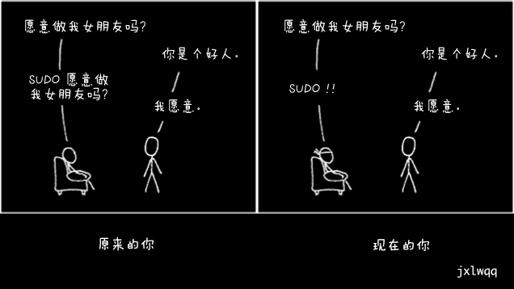
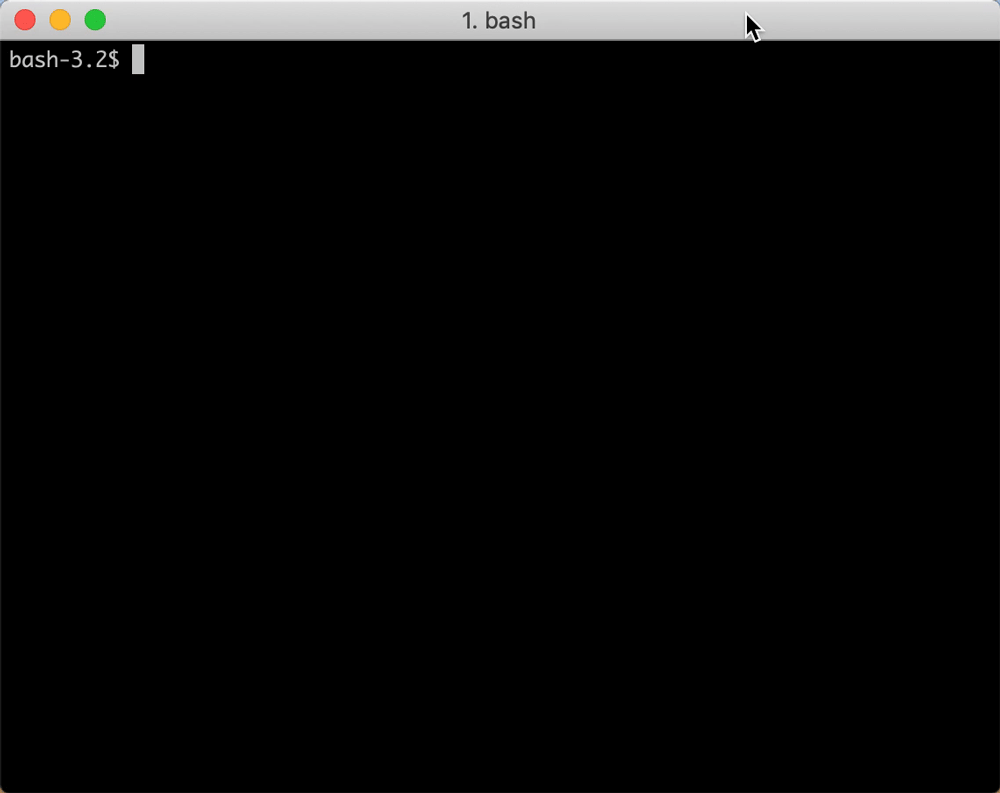
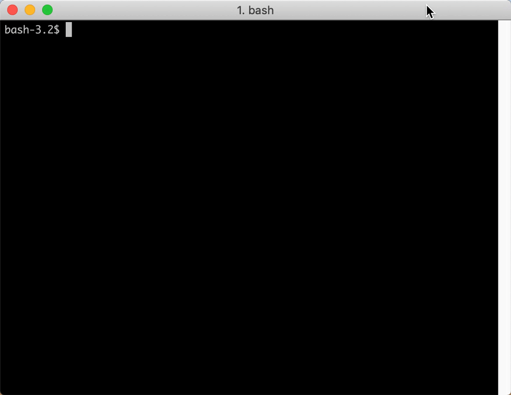
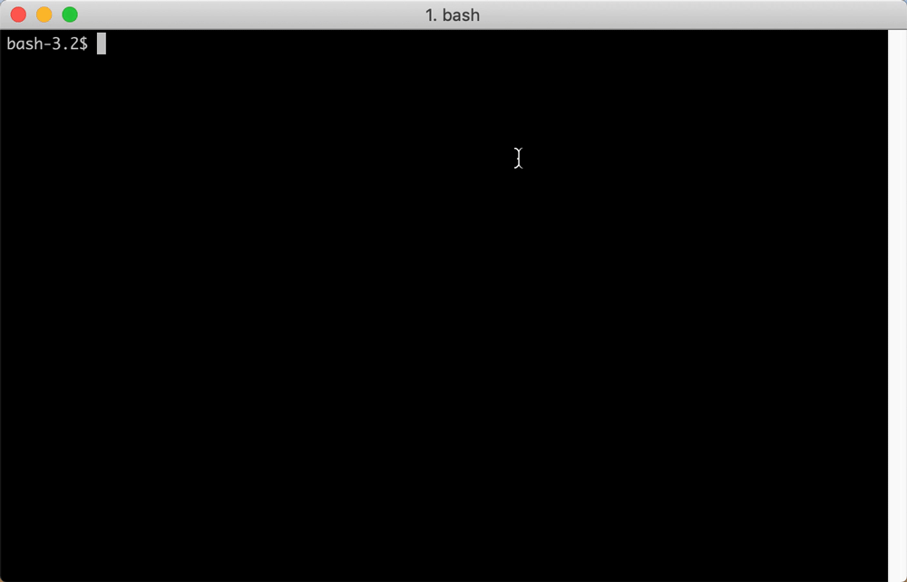
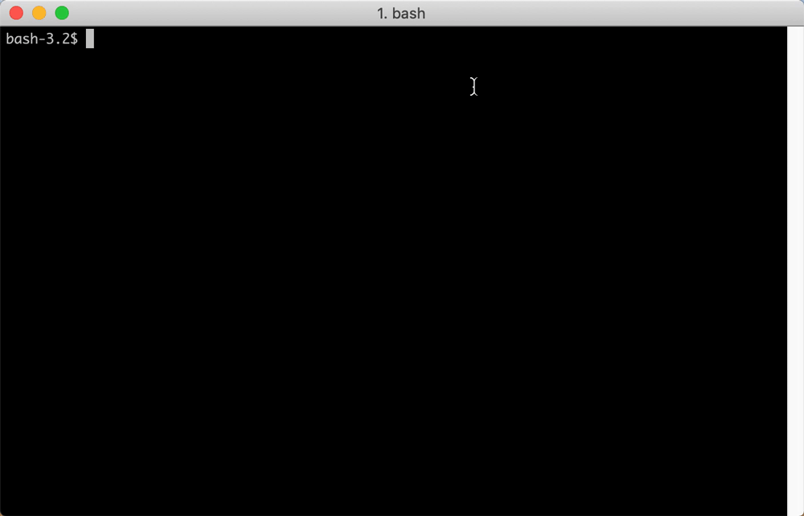

# 短小精悍的命令行合集




## 命令行相关

#### 以管理员身份执行上一个由于权限被拒的命令
```bash
sudo !!
```
示例：



#### 查找并终止进程
```bash
kill $(ps aux | grep '[p]rocess_name' | awk '{print $2}')
```

小技巧：被搜索字符串的首个字符被过滤器`[]`包裹，可忽略`grep`进程本身。

#### 统计并显示历史记录中最常用的命令
```bash
history | awk 'BEGIN {FS="[ \t]+|\\|"} {print $3}' | sort | uniq -c | sort -nr | head
```

示例：




## 快捷键相关

> 默认以 Mac 键盘示例，Windows 用户请将 `control` 键改为 `Ctrl` 键。
> GIF 示例图右下角会显示当前使用的快捷键组合。

#### 搜索并执行过去使用过的命令
control + R 进入`反向搜索`模式。
```bash
(reverse-i-search)`':
```

示例：





#### 移动光标

control + A 将光标移动至命令行开头位置；

control + E 将光标移动只命令行结尾位置；

示例：




## 鸣谢

* 录屏工具：[Kap](https://github.com/wulkano/kap)
* 快捷键可视化工具：[KeyCastr](https://github.com/keycastr/keycastr)

## TODO
- [ ] 为每一个技巧配上 gif 图


